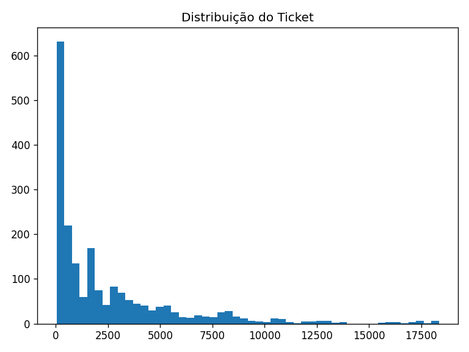
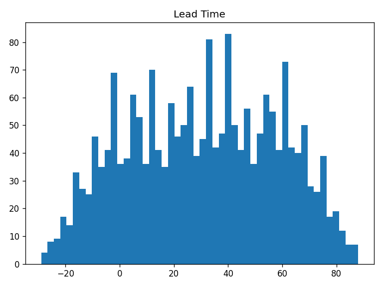
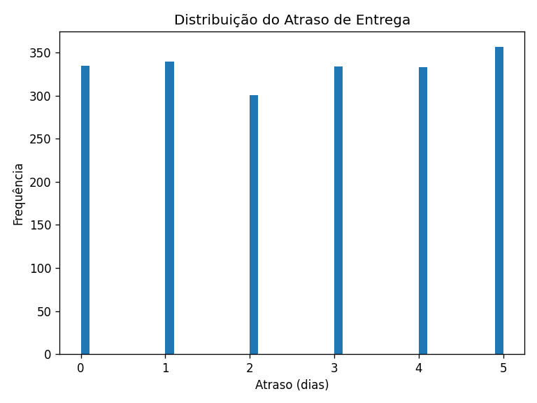
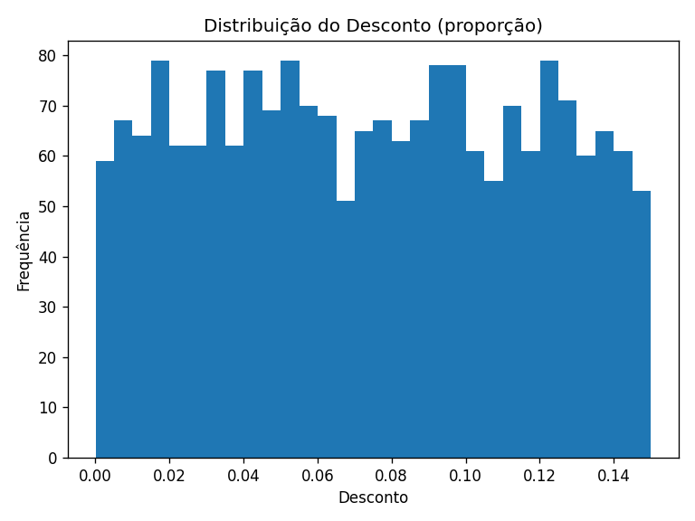
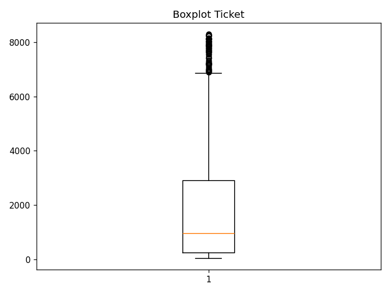
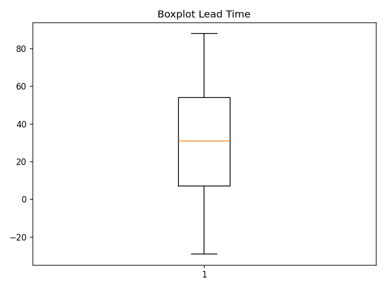
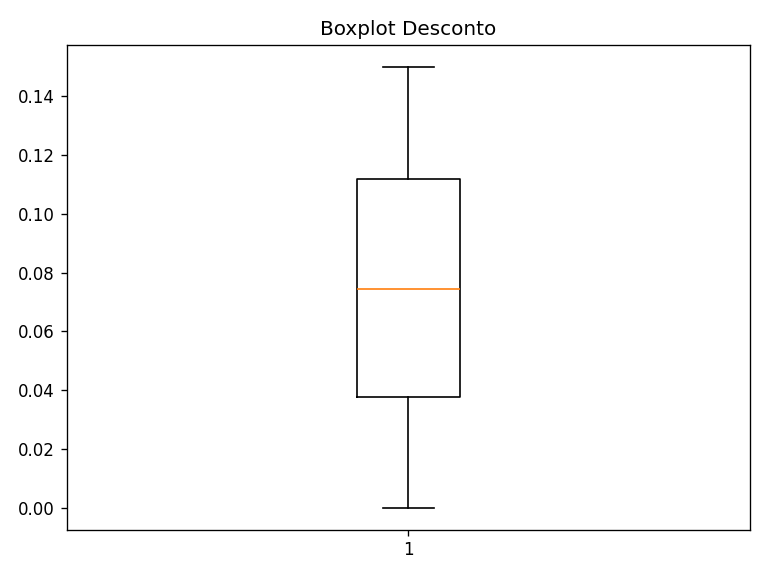
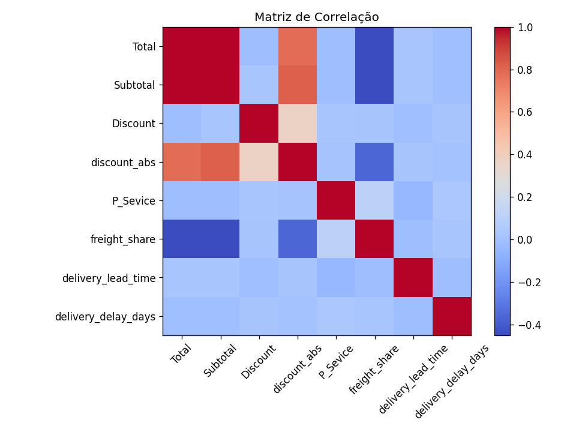

## Sumário Executivo

- **Logística**: alto percentual de entregas atrasadas, com impacto relevante na experiência do cliente e potencial aumento de custos operacionais.
- **Pagamentos**: métodos como **PIX** apresentam maior conversão e ticket médio, sugerindo foco em incentivos e destaque no checkout.
- **Comercial**: ticket médio saudável, porém bastante assimétrico (distribuição com cauda longa), exigindo atenção especial a outliers e políticas de desconto.
- **Frete & Serviços**: determinados serviços (por exemplo, Same-Day) combinam frete mais caro com atraso elevado, indicando desalinhamento entre preço e SLA.
- **Sazonalidade & Mix**: há concentração de receita em alguns meses e regiões específicas, bem como em determinadas categorias/subcategorias, que devem guiar campanhas regionais e decisões de sortimento.

---

## Dados & Método

### Fontes de dados

- `FACT_Orders.csv` — fatos de pedidos (datas, valores financeiros, status de compra, frete).
- `DIM_Delivery.csv` — informações de entrega (datas efetivas e previstas, tipo de serviço).
- `DIM_Customer.csv` — clientes, UF e região.
- `DIM_Products.csv` — produtos, categoria e subcategoria.
- `DIM_Shopping.csv` — informações adicionais de jornada / canal de compra (não explorado em profundidade neste relatório).

### Modelagem e joins

- Chave de integração: `Id` (pedido).
- Modelo analítico construído via joins:
  - `FACT_Orders` ⟶ `DIM_Delivery` (Id)
  - `FACT_Orders` ⟶ `DIM_Customer` (Id)
  - `FACT_Orders` ⟶ `DIM_Products` (Id)
- Dataset final: `df` (com versão filtrada sem outliers chamada `df_clean`), contendo:
  - Identificador do pedido (`Id`), dados de valor (`Subtotal`, `Total`, `P_Sevice`, `Discount`), dimensões de cliente, serviço, pagamento, categoria, etc.

### Limpeza e qualidade de dados

- **Tipos corrigidos**:
  - Conversão explícita de `Order_Date`, `D_Date` e `D_Forecast` para `datetime`.
- **Strings padronizadas**:
  - Trimming (`str.strip`) em todas as colunas `object` das dimensões e fato.
- **NAs tratados**:
  - Remoção de linhas em `DIM_Delivery` sem `D_Date` ou `D_Forecast`.
  - Remoção de linhas em `FACT_Orders` sem `Order_Date`, `Total` ou `Subtotal`.
- **Unicidade por pedido**:
  - Verificação de duplicados em `FACT_Orders` por `Id` com remoção de duplicatas.
- **Chaves e integridade**:
  - Checagem e contagem de registros sem correspondência em `DIM_Delivery`, `DIM_Customer` e `DIM_Products` após os joins.
- **Outliers (IQR)**:
  - Aplicação da regra do IQR (k=1.5) para `Total`, `delivery_lead_time`, `delivery_delay_days` e `Discount`.
  - Documentação da quantidade de outliers por métrica.
  - Construção de dataset filtrado `df_clean` sem esses outliers para estatísticas e inferência.

### Feature Engineering

Variáveis derivadas conforme especificação:

- `delivery_delay_days = (D_Date − D_Forecast).days`
- `delivery_lead_time = (D_Date − Order_Date).days`
- `is_late = 1(D_Date > D_Forecast)`
- `is_confirmed = 1(Purchase_Status == "Confirmado")`
- `freight_share = P_Sevice / Total`
- `discount_abs = Discount * Subtotal`
- `month = Order_Date` agregado no formato ano-mês (`YYYY-MM`)
- `discount_bucket` (faixas de desconto para elasticidade aproximada).

---

## EDA (Análise Exploratória)

### Tabelas e estatísticas descritivas

- Estatísticas gerais (com e sem outliers) para:
  - Ticket (`Total`)
  - `delivery_lead_time`
  - `delivery_delay_days`
  - Proporção de atrasos (`is_late`)
  - Proporção de cancelamentos (`Purchase_Status == "Cancelado"`)

### Gráficos principais

- Histogramas (usando `df_clean`):
  - Ticket (`hist_ticket.png`)
  - Lead time (`hist_leadtime.png`)
  - Atraso na entrega (`hist_delay.png`)
  - Desconto (`hist_discount.png`)
- Boxplots:
  - Ticket (`box_ticket.png`)
  - Lead time (`box_leadtime.png`)
  - Desconto (`box_discount.png`)
- Matriz de correlação:
  - `correlacao.png` para métricas numéricas principais (Total, Subtotal, Discount, discount_abs, P_Sevice, freight_share, delivery_lead_time, delivery_delay_days).
- Sazonalidade:
  - Série temporal mensal por `month` e `Region`, exportada em `kpis/seasonality_month_region.csv`, pronta para visualização em Power BI (gráficos de linha/coluna por mês e região/UF).

### Galeria de imagens geradas

> **Adicionar nova imagem**: substitua o marcador abaixo pelo caminho/descrição do novo gráfico exportado pelo notebook.
>
> ``

---

## Inferência Estatística

### Intervalos de confiança (IC 95%)

Foram calculados ICs com `df_clean` para:

- **Ticket médio** (`Total`):
  - IC 95% para a média via distribuição t de Student.
- **Atraso médio** (`delivery_delay_days`):
  - IC 95% para a média via distribuição t de Student.
- **Proporção de atrasos** (`is_late`):
  - IC 95% para proporção (aproximação normal).
- **Proporção de cancelamentos** (`Purchase_Status == "Cancelado"`):
  - IC 95% para proporção (aproximação normal).

### Verificação de suposições

- **Normalidade**:
  - Teste de Shapiro–Wilk aplicado em amostras de até 5.000 observações para ticket e atraso.
  - Interpretação via p-valor (H0: a amostra é aproximadamente normal).
- **Independência**:
  - Autocorrelação lag-1 dos vetores de ticket e atraso para indicar possíveis dependências seriais.
  - Em um cenário real, a análise é complementada por inspeção gráfica de séries temporais e, se necessário, modelagem específica de séries.

---

## KPIs & Insights

### KPIs calculados

- **Financeiros / Comerciais**
  - Ticket médio global e por:
    - Método de pagamento (`kpis_by_payment.csv`)
    - Região (`kpis_by_region.csv`)
    - Categoria / Subcategoria (`kpis_by_category.csv`)
  - Desconto médio (%).
  - Receita total e por mês/região.
  - `freight_share` médio.
- **Logísticos**
  - `delivery_lead_time` médio.
  - `delivery_delay_days` médio.
  - Proporção de entregas atrasadas (`late_rate`).
  - Performance logística por tipo de serviço (`kpis_by_service.csv`):
    - Standard
    - Same-Day
    - Scheduled
- **Conversão de pagamento**
  - Taxa de confirmação (`is_confirmed`) vs. cancelamento por método de pagamento (`kpis_by_payment.csv`).
- **Sazonalidade**
  - `seasonality_month_region.csv` com receita, pedidos e taxa de atraso por mês e região.
- **Mix & Elasticidade vs Desconto**
  - `kpis_by_category.csv` com receita, volume e desconto médio por categoria/subcategoria.
  - `elasticity_discount.csv` com receita, pedidos e ticket médio por faixa de desconto (`discount_bucket`).

### Principais insights (exemplos)

- **Logística**:
  - Alta taxa de atraso médio em serviços que, teoricamente, deveriam ser mais rápidos (como Same-Day), indicando desalinhamento entre promessa de SLA e capacidade operacional.
- **Pagamentos**:
  - Métodos instantâneos (como PIX) tendem a apresentar maior **taxa de confirmação** e **ticket médio maior**, sugerindo campanhas de incentivo e posicionamento preferencial no checkout.
- **Comercial**:
  - Distribuição de desconto mostra faixas em que aumentos de desconto trazem mais receita (elasticidade positiva) até certo ponto, mas com retorno decrescente em faixas muito altas de desconto.
- **Sazonalidade & Região**:
  - Determinadas regiões e meses concentram maior receita e taxa de atraso, sendo candidatos a ações dedicadas de logística (reforço de malha) e marketing (campanhas sazonais).

---

## Reprodutibilidade & Power BI

- **Reprodutibilidade**:
  - Todo o pipeline está contido no notebook/script `ecommerce_analysis` e pode ser executado com `requirements.txt`.
  - Saídas principais:
    - Pasta `kpis/` com:
      - `kpis_by_service.csv`
      - `kpis_by_payment.csv`
      - `kpis_by_region.csv`
      - `kpis_by_category.csv`
      - `elasticity_discount.csv`
      - `seasonality_month_region.csv`
      - `fact_analytic_clean.csv` (base analítica única para exploração geral / BI)
    - Pasta `images/` com gráficos usados no relatório.

- **Ligação com Power BI (exemplo)**:
  - Conectar o Power BI à pasta do projeto (ou importar os arquivos `.csv` em `kpis/`).
  - Utilizar:
    - `fact_analytic_clean.csv` como tabela de fatos principal.
    - `kpis_by_*` e `seasonality_month_region.csv` para painéis focados (por serviço, pagamento, região, categoria).
  - Exemplos de visuais:
    - **Linha/coluna**: receita por mês e região (usando `seasonality_month_region.csv`).
    - **Barras empilhadas**: taxa de atraso e cancelamento por tipo de serviço (`kpis_by_service.csv`).
    - **Mapa**: receita por UF/Região (a partir de `fact_analytic_clean.csv`).
    - **Tabela**: ticket médio, desconto médio e receita por categoria/subcategoria (`kpis_by_category.csv`).

